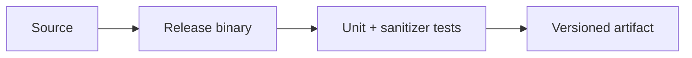

<p align="center">
  
</p>

# SentinelAI — Reproducible Drift-Monitoring Reference System

[](https://github.com/CoreyLeath-code/SentinelAI/actions/workflows/ci-cd.yml)
[](https://github.com/CoreyLeath-code/SentinelAI/actions/workflows/benchmarks.yml)
[](https://github.com/CoreyLeath-code/SentinelAI/actions/workflows/security.yml)
[](https://github.com/CoreyLeath-code/SentinelAI/actions/workflows/sast.yml)
[](https://github.com/CoreyLeath-code/SentinelAI/actions/workflows/data-validation.yml)
[](benchmarks/benchmark_report.md)
[](benchmarks/benchmark_report.md)
[](LICENSE)

## Abstract

SentinelAI is a multi-service observability prototype for AI systems. Its directly implemented statistical component compares an expected and an observed histogram with Population Stability Index (PSI) and a Kolmogorov–Smirnov (KS) CDF distance, then raises a drift flag when either configured threshold is crossed.

The versioned evidence measures a portable Python reference of that decision rule on seeded 32-bin synthetic histograms—not native C++ execution, HTTP latency, concurrent service load, or production drift-detection accuracy. The benchmark is a repeatable regression signal, not a claim of real-world model quality.

## Formal decision rule

Let $p=(p_1,...,p_B)$ and $q=(q_1,...,q_B)$ be expected and actual histogram-bin weights. The C++ engine computes

$
\operatorname{PSI}(p,q) = \sum_{i=1}^{B}(q_i-p_i)\log\left(\frac{q_i}{p_i}\right),
$

summing only bins where both values are positive. It also forms normalized cumulative distributions:

$
P_k=\sum_{i=1}^{k}\frac{p_i}{\sum_jp_j},\qquad Q_k=\sum_{i=1}^{k}\frac{q_i}{\sum_jq_j},\qquad \operatorname{KS}(p,q)=\max_{1\leq k\leq B}|P_k-Q_k|.
$

The implementation emits a drift event when

$
\operatorname{drift}(p,q)=[\operatorname{PSI}(p,q)>0.20]\lor[\operatorname{KS}(p,q)>0.10].
$

This logic is implemented in [drift-engine/drift_engine.cpp](drift-engine/drift_engine.cpp) and mirrored by [benchmarks/run_benchmark.py](benchmarks/run_benchmark.py). The benchmark supplies normalized positive bins; the service does not add smoothing to zero-valued PSI bins, so zero handling is an explicit limitation of the present implementation.

For $B$ bins, PSI and KS each make one linear pass: $O(B)$ time and $O(1)$ auxiliary working memory (apart from the input vectors). The calculation is not a hypothesis test: the two thresholds are fixed decision settings, not calibrated p-values.

## Evidence snapshot

| Measured quantity | Value | What it measures |
|---|---:|---|
| Timed reference evaluations | 20,000 | Seeded, single-process Python decision evaluations after 100 warm-ups |
| Reference latency (median / p95 / p99) | 39.700 / 54.700 / 76.200 µs | Per-decision Python reference latency |
| Reference throughput | 23,031.13 operations/s | Same Python reference workload |
| Peak traced memory | 0.623 MiB | Python allocations reported by tracemalloc |
| Synthetic decision precision / recall / F1 | 1.000 / 1.000 / 1.000 | 2,000 deliberately separated seeded perturbation cases |
| Decision thresholds | PSI > 0.20 or KS > 0.10 | Thresholds hard-coded by the C++ reference implementation |

The full protocol, environment (CPython 3.12.13 on Windows 11), raw confusion matrix, and limitations are versioned in [benchmarks/latest.json](benchmarks/latest.json) and explained in [benchmarks/benchmark_report.md](benchmarks/benchmark_report.md). Reproduce the artifact with:

```bash
python benchmarks/run_benchmark.py --output benchmarks/latest.json
```

## Research questions

1. Under a leakage-free, labeled production dataset, how well do the fixed PSI/KS thresholds detect meaningful distribution shift?
2. How sensitive are false positives and false negatives to bin count, threshold selection, and zero-bin handling?
3. How does native C++ and end-to-end service latency scale with histogram size and concurrent requests?
4. Which operational metrics best distinguish feature drift from changes in data volume or service latency?

## Production Readiness Guide

> This section is the portfolio audit entry point for **SentinelAI**. It describes an engineering promotion path; it is not a claim that the repository is already production-authorized.

### Architecture flowchart



### Quickstart and local validation

The repository uses Python services, a Go ingestion service, and a small C++ drift executable. Reproduce the portable evidence or build the statistical engine directly:

```bash
python benchmarks/run_benchmark.py --output benchmarks/latest.json
g++ -std=c++17 drift-engine/drift_engine.cpp -o drift-engine/drift_engine
```

If the project uses external services, model artifacts, cloud credentials, or private data, start them through documented local fixtures or mocks. Never place secrets or identifiable records in the repository.

### Research-style metrics and benchmarks

| Evidence | Required record |
|---|---|
| Correctness | Test command, commit SHA, runtime, and pass/fail result |
| Performance | Warm-up, sample count, concurrency, median, p95, p99, throughput, and memory |
| Data/model quality | Dataset version, split strategy, leakage controls, calibration, subgroup results, and uncertainty |
| Runtime | Image digest, health-check latency, resource limits, and rollback target |
| Security | Dependency, secret, SAST, container, and SBOM results |

A benchmark number belongs in a versioned artifact tied to a commit and hardware/runtime description. Engineering benchmarks must not be presented as clinical, financial, safety, or model-quality validation without the appropriate domain evidence.

### Extended Q&A

**What is production-ready for this repository?**  
A reproducible build, tested public contract, controlled configuration, observable runtime, documented security boundary, versioned artifacts, and a tested rollback path.

**What must remain explicit?**  
The intended use, excluded use, data/credential handling, model or algorithm limitations, and which metrics are measured versus aspirational.

**What should be completed next?**  
Use the linked production-readiness issue for this repository as the checklist. Resolve missing tests, deployment instructions, observability, supply-chain controls, and release evidence before attaching a production claim.


## 🏛️ Advanced Platform Architecture & Telemetry Decoupling

SentinelAI separates primary inference paths from telemetry and evaluation layers in its local architecture.
[ Incoming User Query ] ───► [ Async Proxy Gateway ] ───► [ Downstream Application ]
│
(Non-Blocking Telemetry Mirror)
▼
┌──────────────────────────────────────┐
│    SentinelAI Asynchronous Engine    │
├──────────────────────────────────────┤
│  • Parallelized Guardrail Evaluation │
│  • GPT-4 Intelligent SRE Diagnostics │
│  • Token Cost & Allocation Trackers  │
└──────────────────┬───────────────────┘
▼
[ Streamlit Observability Control Plane ]

## 🚀 Quickstart — Docker Compose (recommended)

> **Prerequisites:** Docker 24+ with Compose v2 (`docker compose version`).

```bash
# 1. Copy environment defaults
cp .env.example .env

# 2. Start the full local stack
docker compose up --build
```

Once running, open:

| Service | URL |
|---------|-----|
| Streamlit Dashboard | http://localhost:8501 |
| Prometheus | http://localhost:9090 |
| Grafana (admin / admin) | http://localhost:3000 |
| Ingestion API (NGINX gateway) | http://localhost:8080 |
| Drift Engine API | http://localhost:7070 |
| LLM Guard API | http://localhost:8000 |

### Send a sample inference log

```bash
curl -X POST http://localhost:8080/log \
  -H "Content-Type: application/json" \
  -d '{"model_id":"demo","model_version":"v1","latency_ms":120,"tokens_in":32,"tokens_out":64,"status":"ok"}'
```

### Run a drift computation

```bash
curl -X POST http://localhost:7070/drift \
  -H "Content-Type: application/json" \
  -d '{"model_id":"demo","feature_name":"latency","expected":[0.2,0.3,0.25,0.25],"actual":[0.1,0.35,0.30,0.25]}'
```

### Summarize an incident (Ollama optional — falls back to rule-based stub)

```bash
curl -X POST http://localhost:8000/summarize \
  -H "Content-Type: application/json" \
  -d '{"log_data":"PSI 0.35 on latency feature, model demo v1","persist":false}'
```

---

## ⚙️ Configuration

All configuration is via environment variables.  Copy `.env.example` to `.env` and adjust.

| Variable | Default | Description |
|----------|---------|-------------|
| `WAREHOUSE_MODE` | `postgres` | `postgres` (local) or `snowflake` |
| `DATABASE_URL` | Postgres DSN | Full Postgres connection string |
| `POSTGRES_USER` | `sentinel` | Postgres user |
| `POSTGRES_PASSWORD` | `sentinel` | Postgres password |
| `POSTGRES_DB` | `sentinel` | Postgres database |
| `OLLAMA_HOST` | `http://ollama:11434` | Ollama endpoint (optional) |
| `LLM_MODEL` | `llama2` | LLM model name |
| `API_BEARER_TOKEN` | *(unset)* | Required shared bearer token for `POST /infer`; the endpoint returns 503 until configured |

**Snowflake (optional):** set `WAREHOUSE_MODE=snowflake` and fill in `SNOWFLAKE_ACCOUNT`, `SNOWFLAKE_USER`, `SNOWFLAKE_PASSWORD`, `SNOWFLAKE_DATABASE`, `SNOWFLAKE_SCHEMA`, `SNOWFLAKE_WAREHOUSE`.

---

## Load-balanced ingestion path

The host-facing ingestion endpoint is an NGINX gateway at port `8080`; Go ingestion replicas are internal-only and can be started with `docker compose up --build --scale ingestion-service=3`. `/health` is liveness and `/ready` includes the Postgres dependency; the CI smoke test checks gateway readiness, multi-replica routing, and continued readiness after one replica stops. The optional `EXPOSE_INSTANCE_ID=true` setting exists only for that test and is disabled by default.

## 🏗️ Architecture

```
User → NGINX Ingestion Gateway (8080) → Go Ingestion Replicas → Postgres (local) / Snowflake (optional)
                                        ↓
                              Drift Engine C++ (7070)
                                        ↓
                               LLM Guard Python (8000)
                                        ↓
                           Streamlit Dashboard (8501)
                                        ↓
                         Prometheus (9090) + Grafana (3000)
```

### Services

| Service | Language | Port | Description |
|---------|----------|------|-------------|
| `ingestion-service` | Go | 8080 | Receives inference logs, writes to warehouse |
| `drift-engine` | C++ + Python | 7070 | PSI/KS drift detection |
| `llm-guard` | Python | 8000 | LLM-powered incident summarization |
| `streamlit-dashboard` | Python | 8501 | Control plane UI |
| `postgres` | — | 5432 | Local warehouse (default) |
| `prometheus` | — | 9090 | Metrics scraping |
| `grafana` | — | 3000 | Dashboards |

---

## 📊 Research Metrics & Benchmarks

The committed baseline is generated by a seeded, dependency-free harness that mirrors the PSI/KS decision rule in the C++ drift engine. These numbers measure the Python reference implementation—not native C++ or end-to-end HTTP latency. See the [full methodology, interpretation, and limitations](benchmarks/benchmark_report.md) and [raw JSON evidence](benchmarks/latest.json).

### Latest reproducible baseline

| Metric | Value | Protocol | Source |
|---|---:|---|---|
| Timed evaluations | 20,000 | 100 warm-ups, 32 bins, seed `20260718` | `python benchmarks/run_benchmark.py --iterations 20000 --evaluation-samples 2000 --output benchmarks/latest.json`; `benchmarks/run_benchmark.py` → `benchmarks/latest.json` |
| Mean latency | 41.706 µs | Per-decision reference latency | `python benchmarks/run_benchmark.py --iterations 20000 --evaluation-samples 2000 --output benchmarks/latest.json`; `benchmarks/run_benchmark.py` → `benchmarks/latest.json` |
| Median latency | 39.700 µs | Per-decision reference latency | `python benchmarks/run_benchmark.py --iterations 20000 --evaluation-samples 2000 --output benchmarks/latest.json`; `benchmarks/run_benchmark.py` → `benchmarks/latest.json` |
| P95 / P99 latency | 54.700 / 76.200 µs | Linear percentile interpolation | `python benchmarks/run_benchmark.py --iterations 20000 --evaluation-samples 2000 --output benchmarks/latest.json`; `benchmarks/run_benchmark.py` → `benchmarks/latest.json` |
| Minimum / maximum | 23.700 / 319.200 µs | Observed range | `python benchmarks/run_benchmark.py --iterations 20000 --evaluation-samples 2000 --output benchmarks/latest.json`; `benchmarks/run_benchmark.py` → `benchmarks/latest.json` |
| Throughput | 23,031.13 operations/s | Single-process CPython reference | `python benchmarks/run_benchmark.py --iterations 20000 --evaluation-samples 2000 --output benchmarks/latest.json`; `benchmarks/run_benchmark.py` → `benchmarks/latest.json` |
| Peak traced memory | 0.623 MiB | Python `tracemalloc` | `python benchmarks/run_benchmark.py --iterations 20000 --evaluation-samples 2000 --output benchmarks/latest.json`; `benchmarks/run_benchmark.py` → `benchmarks/latest.json` |
| Precision / recall / F1 | 1.000 / 1.000 / 1.000 | 2,000 balanced synthetic cases | `python benchmarks/run_benchmark.py --iterations 20000 --evaluation-samples 2000 --output benchmarks/latest.json`; `benchmarks/run_benchmark.py` → `benchmarks/latest.json` |
| Confusion matrix | TP 1000 · TN 1000 · FP 0 · FN 0 | Controlled seeded classes | `python benchmarks/run_benchmark.py --iterations 20000 --evaluation-samples 2000 --output benchmarks/latest.json`; `benchmarks/run_benchmark.py` → `benchmarks/latest.json` |
| Environment | CPython 3.12.13 · Windows 11 | Recorded 2026-07-18 | `python benchmarks/run_benchmark.py --iterations 20000 --evaluation-samples 2000 --output benchmarks/latest.json`; `benchmarks/run_benchmark.py` → `benchmarks/latest.json` |

### Benchmark scope and reproducibility

```bash
python benchmarks/run_benchmark.py --output benchmarks/latest.json
```

CI reruns the benchmark on every pull request, validates its schema and F1 regression floor, and uploads raw evidence for 30 days. For comparable hosts, median or P95 increases above 15% require investigation and a documented baseline update.

The perfect synthetic classification result is a regression signal for deliberately separated perturbation classes; it is **not** a production accuracy claim. Native C++, service concurrency, network, warehouse, GPU, and real-world labeled drift benchmarks remain future evaluation layers.

### Test and evidence status

| Evidence | Current state | Source |
|---|---:|---|
| Benchmark raw data | Versioned JSON | `benchmarks/latest.json` |
| Benchmark methodology | Versioned report | `benchmarks/benchmark_report.md` |
| Benchmark CI | Required execution + artifact | `.github/workflows/benchmarks.yml` |
| Drift thresholds | PSI 0.20 · KS 0.10 | `g++ -std=c++17 drift-engine/drift_engine.cpp -o drift-engine/drift_engine`; source: `drift-engine/drift_engine.cpp` |

### Observability Metrics

| Metric Name | Type | Emitted By | Purpose |
|---|---|---|---|
| `sentinel_requests_total` | Counter | `monitoring/metrics.py` | API request volume |
| `sentinel_request_latency_seconds` | Histogram | `monitoring/metrics.py` | API request latency |
| `inference_requests_total` | Counter | `monitoring/prometheus.py` | Inference request volume |
| `ingestion_logs_total{status}` | Counter | `ingestion-service/main.go` | Ingestion outcome counts |
| `ingestion_handler_seconds` | Histogram | `ingestion-service/main.go` | Go ingestion handler latency |
| `drift_detected_total` | Counter | `drift-engine/server.py` | Drift event count |
| `drift_compute_seconds` | Histogram | `drift-engine/server.py` | Drift calculation latency |
| `llm_guard_summaries_total{method}` | Counter | `llm-guard/app.py` | Ollama vs fallback summary count |
| `llm_guard_summary_seconds` | Histogram | `llm-guard/app.py` | Summary generation latency |
| `requests_total` | Counter | `backend/app/main.py` | Backend request volume |


## Design Targets (Not Measured)

The following historical values are retained for planning and comparison, but no committed generator or CI artifact establishes them as current measurements at this commit. They must not be treated as benchmark results or release evidence.

### Historical validation claims

| Evidence | Current state | Evidence status |
|---|---:|---|
| Focused API tests | 4 passed | No committed command/output establishes this historical audit value |
| Focused API coverage | 24% | No committed command/output establishes this historical audit value; the former static badge was removed |

### Historical project inventory

| Area | Metric | Current Value | Source |
|---|---:|---:|---|
| Codebase | Tracked files | 98 | `git ls-files` |
| Codebase | Python files | 32 | `*.py` files |
| Codebase | Go files | 1 | `ingestion-service/main.go` |
| Codebase | C++ files | 4 | Drift and ingestion engine sources |
| Codebase | TypeScript files | 7 | `frontend/` |
| Codebase | Source NCLOC | 1,201 | Non-empty, non-comment Python/Go/C++/TS lines |
| Tests | Python test files | 6 | `tests/` |
| Tests | Test declarations | 5 | `def test_*` scan |
| Tests | Focused API validation | 4 passed | `pytest tests/test_*.py` focused API scope |
| Tests | Focused `api` coverage | 24% | Local coverage run |
| CI/CD | GitHub Actions workflows | 7 | `.github/workflows/*.yml` |
| Dependencies | Python runtime dependencies | 11 | `requirements.txt` |
| Delivery | Dockerfiles | 5 | Root/services/dashboard Docker assets |
| Delivery | Kubernetes manifests | 9 | `k8s/*.yaml` |
| Delivery | Helm chart files | 1 | `helm/sentinel/templates/deployment.yaml` |
| Infrastructure | Terraform files | 1 | `terraform/main,TF` |
| Monitoring | Monitoring config files | 5 | `monitoring/` |
| Services | Docker Compose service URLs | 6 | Dashboard, Prometheus, Grafana, ingestion, drift, LLM guard |
| Validation limits | Native Go/C++ compile checks | Not run locally | Go/g++/MSVC unavailable in workspace |

---

## 🧠 Extended Q&A

### Why use C++ for drift detection?
To achieve sub-millisecond statistical scoring at scale.

### Why Go for ingestion?
Go provides efficient concurrency and low-latency HTTP handling.

### Why Postgres locally (not Snowflake)?
Postgres is free, runs in Docker, and supports the same SQL schema.  Switch to `WAREHOUSE_MODE=snowflake` when you're ready to push to production.

### Why MLflow?
Experiment tracking, reproducibility, and version control.

### Why LangChain + Ollama?
LLM-powered root cause summarization and RAG over historical incidents.

### Why Kubernetes?
Horizontal scaling and production-grade orchestration.

### Why Terraform?
Reproducible infrastructure as code.

---

## 🏢 Enterprise Value

SentinelAI demonstrates:

- AI system lifecycle management
- Drift monitoring
- MLOps integration
- Distributed systems engineering
- Cloud-native architecture
- LLM augmentation
- Observability & metrics-driven design

---

## 🔧 Recent Code Improvements

See [CHANGELOG.md](CHANGELOG.md) for the dated fix history.

### Running tests locally

```bash
pip install -r requirements.txt
pytest tests/ -v
```

### Environment variables added

| Variable | Default | Description |
|----------|---------|-------------|
| `API_USERNAME` | `admin` | Login username for the API auth endpoint |
| `API_PASSWORD` | *(unset — auth disabled until set)* | Login password; must be set to enable auth |
| `LLM_MODEL_NAME` | `meta-llama/Meta-Llama-3-8B` | HuggingFace model used by the inference route |

---


- Add automated retraining pipeline
- Add Shadow Model Deployment
- Add Cost Optimization Engine
- Add Hallucination Classifier Model


