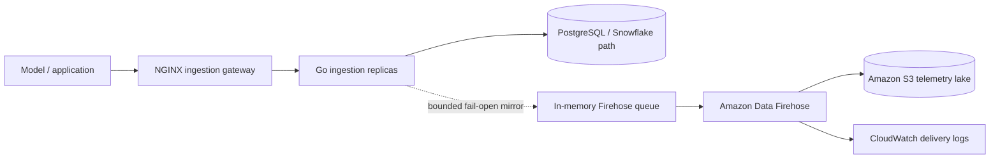

# Amazon Data Firehose + S3 telemetry path

SentinelAI can optionally mirror accepted inference telemetry from the Go ingestion service to Amazon Data Firehose. Firehose buffers the records and delivers GZIP-compressed newline-delimited JSON (NDJSON) objects to a private S3 telemetry bucket.

This AWS path is **optional**. Local Docker Compose keeps `FIREHOSE_ENABLED=false`, so PostgreSQL remains the default local persistence path and no AWS account is required for development.

## Architecture



The Firehose mirror intentionally does not participate in `/ready`. A temporary AWS failure increments `ingestion_firehose_records_total{status="error"}` and is logged, while the primary ingestion response continues to reflect the primary warehouse write. If the bounded queue fills, records are dropped from the mirror and counted with `status="dropped"` rather than allowing telemetry backpressure to take down ingestion.

## Provision the AWS resources

Prerequisites:

- Terraform 1.6+
- AWS credentials available through the standard AWS credential chain
- Permission to create S3, Firehose, CloudWatch Logs, IAM policy/role, and ECR resources

```bash
cd terraform
terraform init
terraform fmt -check
terraform validate
terraform plan
terraform apply
```

The default configuration creates:

- a private, versioned S3 bucket with SSE-S3 encryption;
- a 30-day telemetry lifecycle policy;
- an Amazon Data Firehose delivery stream named `sentinelai-telemetry`;
- 60-second / 5-MiB buffering with GZIP compression;
- time-partitioned S3 keys under `inference/year=.../month=.../day=.../hour=.../`;
- a CloudWatch log group for Firehose delivery errors;
- a Firehose service role with only the S3 and CloudWatch permissions it needs;
- a separate `sentinelai-firehose-writer` IAM policy granting `PutRecord` and `PutRecordBatch` to the SentinelAI workload;
- the existing SentinelAI ECR repository, now defined in a valid Terraform `.tf` file.

Use `terraform output` after apply to retrieve the generated S3 bucket name, stream ARN, stream name, and writer-policy ARN.

## Give the ingestion workload permission

Do not put long-lived AWS access keys in the repository. Attach the Terraform output `firehose_writer_policy_arn` to the workload identity used by SentinelAI. On EKS, the intended production pattern is an IAM role associated with the ingestion service account (IRSA / EKS workload identity).

For local development against a real AWS account, the AWS SDK for Go v2 uses its normal credential provider chain. Keep credentials outside the repo.

## Enable the mirror

```bash
export FIREHOSE_ENABLED=true
export FIREHOSE_DELIVERY_STREAM=sentinelai-telemetry
export FIREHOSE_QUEUE_SIZE=1000
export AWS_REGION=us-east-1
```

Then start SentinelAI and send a normal inference log:

```bash
curl -X POST http://localhost:8080/log \
  -H "Content-Type: application/json" \
  -d '{"model_id":"demo","model_version":"v1","latency_ms":120,"tokens_in":32,"tokens_out":64,"status":"ok"}'
```

The producer appends a newline to every JSON record before `PutRecord`. That keeps individual events parseable after Firehose concatenates buffered records into S3 objects.

## Observability

The ingestion service exports:

```text
ingestion_firehose_records_total{status="queued"}
ingestion_firehose_records_total{status="delivered"}
ingestion_firehose_records_total{status="error"}
ingestion_firehose_records_total{status="dropped"}
```

CloudWatch delivery logs cover the managed Firehose-to-S3 leg. Application metrics cover the producer-side queue and `PutRecord` result.

## Failure semantics

This feature is a telemetry mirror, not a transactional dual-write guarantee. The in-memory queue is intentionally bounded and is not persisted across process termination. AWS SDK retries may also produce duplicate Firehose records in some failure scenarios. Consumers should therefore treat the S3 telemetry dataset as at-least-once/best-effort observability data and use stable event identifiers if strict de-duplication is later required.

## Cost control

Firehose, S3, CloudWatch Logs, and related data transfer can incur AWS charges. The default 30-day S3 expiration and 14-day CloudWatch log retention are intended to keep a portfolio/dev deployment bounded. Review the Terraform plan and AWS pricing before leaving the stack running.
